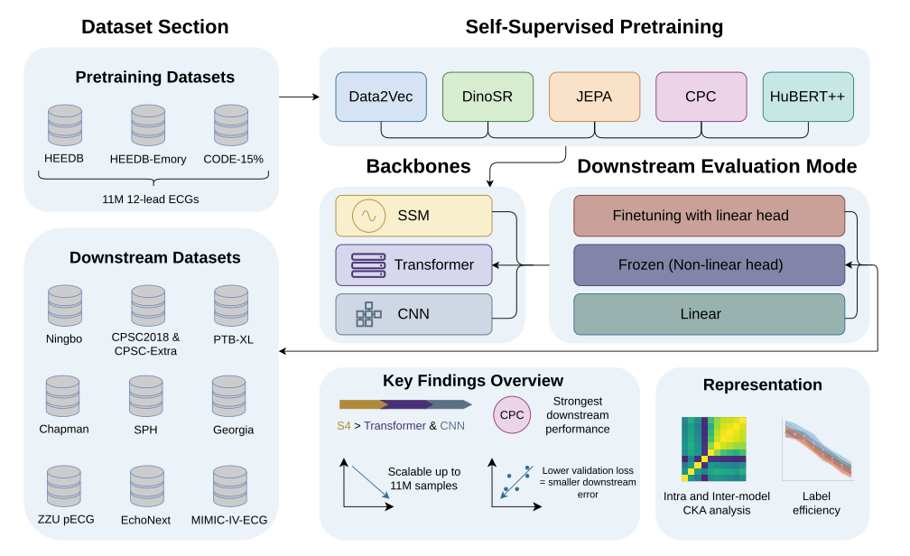

# Pretraining Strategies and Scaling for ECG Foundation Models: A Systematic Study

The official repository for the paper [Pretraining Strategies and Scaling for ECG Foundation Models: A Systematic Study](https://arxiv.org/abs/2605.12241)

[](https://arxiv.org/abs/2605.12241)

Specialized foundation models are beginning to emerge in various medical subdomains, but pretraining methodologies and parametric scaling with the size of the pretraining dataset are rarely assessed systematically and in a like-for-like manner. This work focuses on foundation models for electrocardiography (ECG) data, one of the most widely captured physiological time series world-wide. We present a comprehensive assessment of pretraining methodologies, covering five different contrastive and non-contrastive self-supervised learning objectives for ECG foundation models, and investigate their scaling behavior with pretraining dataset sizes up to 11M input samples, exclusively from publicly available sources. Pretraining strategy has a meaningful and consistent impact on downstream performance, with contrastive predictive coding (slightly ahead of JEPA) yielding the most transferable representations across diverse clinical tasks. Scaling pretraining data continues to yield meaningful improvements up to 11M samples for most objectives. We also compare model architectures across all pretraining methodologies and find evidence for a clear superiority of structured state space models compared to transformers and CNN models. We hypothesize that the strong inductive biases of structured state space models, rather than pretraining scale alone, are the primary driver of effective ECG representation learning, with important implications for future foundation model development in this and potentially other physiological signal domains.



---

## 📂 Datasets

You can download the datasets from the following sources:

- [PTB-XL](https://physionet.org/content/ptb-xl/1.0.3/) 
- [SPH](https://springernature.figshare.com/collections/A_large-scale_multi-label_12-lead_electrocardiogram_database_with_standardized_diagnostic_statements/5779802/1)  
- [EchoNext](https://physionet.org/content/echonext/1.1.0/)  
- [ZZU pECG](https://doi.org/10.6084/m9.figshare.27078763)  
- [CODE-15%](https://zenodo.org/records/4916206)  
- [Chapman](https://figshare.com/collections/ChapmanECG/4560497)  
- [CPSC2018, CPSC-Extra, Georgia, Ningbo](https://physionet.org/content/challenge-2021/1.0.3/)  (Please include `Label mappings 2021.xlsx` in the respective dataset folder. The [original file](https://docs.google.com/spreadsheets/d/1Q4m9axOlE1rEb7Fi2t4fPbvpw8JPvikLBO_j-lQcuuE/edit?gid=1645151417#gid=1645151417) is linked on the CinC21 challenge website. )
- [MIMIC-IV-ECG](https://physionet.org/content/mimic-iv-ecg/1.0/)  (save under data/ the following files from physionet:
records_w_diag_icd10.csv (MIMIC-IV-ECG-ICD), mds_ed.csv (MDS-ED), machine_measurements.csv (MIMIC-IV-ECG), omr.csv.gz (MIMIC-IV), vitalsign.csv.gz (MIMIC-IV), d_labitems.csv.gz (MIMIC-IV), labevents.csv.gz (MIMIC-IV), d_items.csv.gz (MIMIC-IV), chartevents.csv.gz (MIMIC-IV) )
- [HEEDB, HEEDB-Emory](https://bdsp.io/content/heedb/5.0/) 


---

## 🗂️ HEEDB Pretraining Subsets

For scaling experiments, we use specific HEEDB subsets corresponding to each pretraining scale:

| Scale | HEEDB Subset |
|-------|-------------|
| 18K   | S0001-1987  |
| 45K   | S0001-1990  |
| 106K  | S0001-2019  |
| 753K  | S0001-2007  |
| 11M   | All HEEDB cohorts + HEEDB-Emory + CODE-15% |

---

## 📦 Checkpoints

Download pretrained checkpoints for evaluation:

 
- [ECGFounder](https://huggingface.co/PKUDigitalHealth/ECGFounder/tree/main)  
- [ECG-JEPA](https://drive.google.com/file/d/1gMOT4xjQQg0GZkY1iE6NuDzua4ALw00l/view) 
- [MERL](https://drive.google.com/drive/folders/13wb4DppUciMn-Y_qC2JRWTbZdz3xX0w2)  
- [ECGFM-KED](https://zenodo.org/records/14881564)
- Data2Vec, DinoSR, JEPA, CPC and HuBERT++ weights are given in the checkpoints directory 
 

---

## ⚙️ Installation

Set up the Python environment using the provided YAML files:

```bash
conda env create -f env.yaml
```

---

## 🚀 Quick Start

Follow these steps to set up and run the benchmark:

### 1. Data Preprocessing

First, preprocess all datasets using the provided `preprocess_ecg_dataset.ipynb` Jupyter notebook.

### 2. Configuration Setup

Before running the pretraining and downstream evaluation, configure the necessary paths:

#### Edit `run.sh` file

Open `run.sh` in your preferred text editor and update the following variables with your local paths:

```bash
# Set these paths according to your system
BASE_DIR="/path/to/your/fm-benchmarking"
CHECKPOINTS_DIR="/path/to/your/checkpoints"
DATASET_DIR="/path/to/your/datasets"
```

#### Update dataset path
Modify the dataset path in the `downstream_evaluation/code/clinical_ts/models/conf/data/ecg_ptbxl.yaml`

#### Run `run.sh` file

```bash
sbatch run.sh
```


